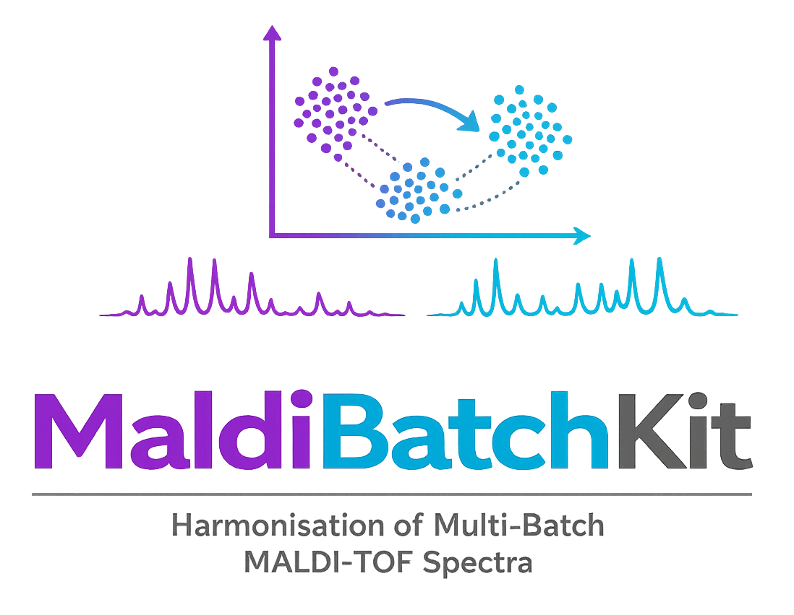

# MaldiBatchKit

[](https://github.com/EttoreRocchi/MaldiBatchKit/actions/workflows/ci.yml)
[](https://codecov.io/github/EttoreRocchi/MaldiBatchKit)
[](https://maldibatchkit.readthedocs.io/en/latest/)
[](https://pypi.org/project/maldibatchkit/)
[](https://github.com/EttoreRocchi/MaldiBatchKit/blob/main/LICENSE)

<p align="center">
  
</p>

<p align="center">
  <strong>Batch-effect correction methods for MALDI-TOF spectra in clinical AMR prediction workflows</strong>
</p>

<p align="center">
  <a href="#installation">Installation</a> •
  <a href="#features">Features</a> •
  <a href="#quick-start">Quick Start</a> •
  <a href="#algorithms">Algorithms</a> •
  <a href="#diagnostics">Diagnostics</a> •
  <a href="#maldisuite-ecosystem">MaldiSuite</a> •
  <a href="#citation">Citation</a>
</p>

MaldiBatchKit is part of the **MaldiSuite** ecosystem and complements [MaldiAMRKit](https://github.com/EttoreRocchi/MaldiAMRKit): where MaldiAMRKit handles preprocessing, alignment and AMR-aware evaluation, MaldiBatchKit focuses on the *harmonization* step, removing the inter-batch / inter-site shifts that plague multi-centre MALDI-TOF studies.

## Installation

```bash
pip install maldibatchkit
```

Optional extras:

```bash
pip install maldibatchkit[viz]      # UMAP plots, seaborn
pip install maldibatchkit[dev]      # testing + linting
pip install maldibatchkit[docs]     # sphinx
```

`maldiamrkit` is a core dependency - installing MaldiBatchKit pulls it in automatically. `BatchAwareWarping` reuses `maldiamrkit.alignment.Warping` under the hood, and the `MaldiSetAdapter` bridges to `maldiamrkit.MaldiSet` for end-to-end AMR workflows.

### Install the full MaldiSuite

To install MaldiBatchKit together with [MaldiAMRKit](https://github.com/EttoreRocchi/MaldiAMRKit) and [MaldiDeepKit](https://github.com/EttoreRocchi/MaldiDeepKit) at compatible versions, install the [`maldisuite`](https://pypi.org/project/maldisuite/) meta-package:

```bash
pip install maldisuite
```

Visit the **MaldiSuite** landing page at <https://ettorerocchi.github.io/MaldiSuite/>.

## Features

- **Unified sklearn API** (`BaseEstimator` + `TransformerMixin`) for every correction method. `batch` and covariates are passed at construction time and aligned to `X.index` at `fit` / `transform`, so the same object works inside `Pipeline` / cross-validation without data leakage.
- **ComBat variants** (Johnson 2007, Fortin 2018, Chen 2022 CovBat) re-exported from [combatlearn](https://github.com/EttoreRocchi/combatlearn).
- **Limma `removeBatchEffect`** (Ritchie et al. 2015).
- **Harmony** (Korsunsky et al. 2019) via [harmonypy](https://github.com/slowkow/harmonypy), with a **mandatory, frozen PCA preprocessing stage** so it behaves sensibly on high-dimensional MALDI-TOF intensity matrices (tune with the `n_components=` argument).
- **Simple baselines**: median centering, z-score per batch, reference scaling.
- **MALDI-specific corrections**:
  - `BatchAwareWarping` - per-batch m/z warping sharing a global reference (wraps `maldiamrkit.alignment.Warping`).
  - `QualityWeightedComBat` - weighted empirical-Bayes ComBat variant where low-SNR spectra contribute less to the shrinkage prior.
  - `SpeciesAwareComBat` - convenience preset for ComBat-Fortin with `species` as the protected biological covariate.
- **Diagnostics**: kBET, LISI, silhouette-by-batch, per-batch peak drift, per-batch TIC coefficient of variation, per-batch spectrum count, plus a combined `diagnostic_report` DataFrame summary.
- **Method selection**: `AutoCorrector` exposes `method` as a settable hyperparameter so `GridSearchCV` can sweep across corrector families and let the downstream classifier metric (AUROC) decide. Ships with a `NoOpCorrector` so "do nothing" can sit on the candidate list as an honest baseline.
- **Diagnostic benchmark**: `BatchCorrectionBenchmark` runs a fixed set of metrics across multiple correctors with stratified bootstrap CIs and a tidy `(method, metric, value, ci_lo, ci_hi)` summary, ready for paper-figure comparisons.
- **Visualization**: UMAP before/after, per-batch peak-shape overlays, before/after bar charts.
- **Integration adapter**: `MaldiSetAdapter` turns a `maldiamrkit.MaldiSet` into a corrected `MaldiSet` in one call.
- **CLI**: `maldibatchkit correct ...` and `maldibatchkit diagnose ...`.

## Quick start

```python
from maldibatchkit import ComBat, QualityWeightedComBat, SpeciesAwareComBat
from maldibatchkit.diagnostics import diagnostic_report

# X: (n_samples, n_bins) DataFrame; batch & species indexed by X.index
corrector = SpeciesAwareComBat(batch=batch, species=species)
X_corrected = corrector.fit_transform(X)

report = diagnostic_report(X, X_corrected, batch)
print(report)
```

Train/test without leakage:

```python
from sklearn.model_selection import train_test_split

X_train, X_test, y_train, y_test = train_test_split(X, y, stratify=batch)

corrector = ComBat(batch=batch, method="fortin", discrete_covariates=species)
corrector.fit(X_train)              # learns on train only
X_train_c = corrector.transform(X_train)
X_test_c  = corrector.transform(X_test)   # same parameters applied to test
```

`batch` is indexed by the same sample IDs that X uses, so the corrector picks the right subset on each call.

### MaldiSet integration

```python
from maldiamrkit import MaldiSet
from maldibatchkit.integrations import MaldiSetAdapter
from maldibatchkit import SpeciesAwareComBat

ds = MaldiSet.from_directory(...)
adapter = MaldiSetAdapter(
    batch_column="Batch",
    species_column="Species",
    quality_column="SNR",
)
corrected_ds = adapter.correct(ds, SpeciesAwareComBat)
corrected_ds.X      # harmonised feature matrix
corrected_ds.y      # AMR labels, unchanged
```

### CLI

The CLI is organised as `maldibatchkit correct <method>` + `maldibatchkit diagnose`. Every method has its own subcommand with only the flags it actually uses:

```bash
# Vanilla Johnson ComBat
maldibatchkit correct combat \
    -i X.csv --batch-csv batch.csv -o X_corrected.csv

# Fortin ComBat with a species covariate
maldibatchkit correct combat-fortin \
    -i X.csv --batch-csv batch.csv \
    --discrete-covariates-csv species.csv \
    -o X_corrected.csv

# Species-aware preset (shortcut for the above)
maldibatchkit correct species-combat \
    -i X.csv --batch-csv batch.csv --species-csv species.csv \
    -o X_corrected.csv

# Quality-weighted ComBat
maldibatchkit correct quality-combat \
    -i X.csv --batch-csv batch.csv --quality-csv snr.csv \
    -o X_corrected.csv

# Diagnostic report
maldibatchkit diagnose \
    -i X.csv --corrected X_corrected.csv \
    --batch-csv batch.csv --mz-csv mz.csv -o report.csv
```

NPZ inputs bundle X, index, columns, and batch labels in one file, so the same commands work without sidecar CSVs:

```bash
maldibatchkit correct combat-fortin \
    -i maldiset.npz \
    --discrete-covariates-csv species.csv \
    -o corrected.npz
```

Run `maldibatchkit correct <method> --help` for the full flag list of any corrector. `combat-fortin` / `combat-chen` refuse to run without covariates (they would silently reduce to Johnson ComBat); `species-combat` / `quality-combat` require their dedicated `--species-csv` / `--quality-csv` inputs.

## Algorithms

| Method                         | Class                     | Protects covariates? | Train/test safe? |
|--------------------------------|---------------------------|----------------------|------------------|
| ComBat (Johnson, Fortin, Chen) | `ComBat`                  | Fortin / Chen        | yes              |
| Limma                          | `Limma`                   | via `design=`        | yes              |
| Harmony                        | `Harmony`                 | via `covariates=`    | yes              |
| Median centering               | `MedianCentering`         | no                   | yes              |
| Z-score per batch              | `ZScorePerBatch`          | no                   | yes              |
| Reference scaling              | `ReferenceScaling`        | no                   | yes              |
| Batch-aware warping            | `BatchAwareWarping`       | no                   | yes              |
| Quality-weighted ComBat        | `QualityWeightedComBat`   | no                   | yes              |
| Species-aware ComBat           | `SpeciesAwareComBat`      | species              | yes              |
| Identity / no-op               | `NoOpCorrector`           | n/a                  | yes              |
| Meta-corrector                 | `AutoCorrector`           | inherits inner       | yes              |

See the `QualityWeightedComBat` docstring for the mathematical formulation of the weighted empirical-Bayes update.

### Choosing a corrector

Picking among the methods above usually means asking one of two
questions: *"which corrector gives the best AMR classifier?"* or
*"which corrector mixes batches best while keeping species apart?"*.
MaldiBatchKit ships one tool for each:

```python
from sklearn.linear_model import LogisticRegression
from sklearn.model_selection import GridSearchCV
from sklearn.pipeline import Pipeline
from maldibatchkit import AutoCorrector

pipe = Pipeline([
    ("correct", AutoCorrector(batch=batch, discrete_covariates=species)),
    ("clf", LogisticRegression(max_iter=1000)),
])
grid = GridSearchCV(
    pipe,
    param_grid={"correct__method": ["noop", "combat-fortin", "harmony", "qw-combat"]},
    scoring="roc_auc",
)
grid.fit(X, y)
```

```python
from maldibatchkit import ComBat, NoOpCorrector
from maldibatchkit.diagnostics import BatchCorrectionBenchmark

bench = BatchCorrectionBenchmark(
    correctors={
        "none":   NoOpCorrector(batch=batch),
        "fortin": ComBat(batch=batch, method="fortin", discrete_covariates=species),
    },
    metrics=("kbet", "lisi_normalized", "species_preservation"),
    n_bootstrap=500,
    random_state=0,
).fit(X, batch=batch, species=species)
bench.rank(by="species_preservation")
```

See [docs / Choosing a corrector](https://maldibatchkit.readthedocs.io/en/latest/choosing.html) for the full recipe.

## Extending MaldiBatchKit

Every corrector in this package inherits from `BaseBatchCorrector`, which is re-exported at the top level. Subclass it, implement `_fit_impl` and `_transform_impl`, and you get a scikit-learn compatible, train/test-safe corrector for free - the base class handles index alignment between `X` and the stored `batch` labels, NaN / finite checks, DataFrame-vs-ndarray round-tripping, and the `feature_names_in_` / `n_features_in_` / `get_feature_names_out` sklearn bookkeeping.

Minimal custom corrector (toy example - not shipped with the package):

```python
import pandas as pd
from maldibatchkit import BaseBatchCorrector

class MyMeanCentering(BaseBatchCorrector):
    """Subtract per-batch means from each feature."""

    def _fit_impl(self, X_df, batch):
        # Store whatever you learn as ``..._`` attributes so
        # ``sklearn.utils.validation.check_is_fitted`` picks them up.
        self.batch_means_ = X_df.groupby(batch).mean()
        self.grand_mean_ = X_df.mean(axis=0)

    def _transform_impl(self, X_df, batch):
        out = X_df.copy().astype(float)
        known = set(self.batch_means_.index)
        for lvl in pd.unique(batch):
            mask = batch == lvl
            offset = (
                self.batch_means_.loc[lvl].to_numpy()
                if lvl in known
                else self.grand_mean_.to_numpy()   # unseen-batch fallback
            )
            out.loc[mask] = out.loc[mask].to_numpy() - offset
        return out
```

Drop it straight into a pipeline:

```python
from sklearn.pipeline import Pipeline
from sklearn.preprocessing import StandardScaler
from sklearn.ensemble import RandomForestClassifier

pipe = Pipeline([
    ("mean", MyMeanCentering(batch=batch)),   # the class defined just above
    ("scaler", StandardScaler()),
    ("clf", RandomForestClassifier()),
])
pipe.fit(X_train, y_train)
pipe.score(X_test, y_test)       # no leakage: transform, never refit
```

Conventions (see `CONTRIBUTING.md`):

- NumPy-style docstring on every public class.
- Fitted attributes end in `_` (`self.batch_means_`, not `self.means`).
- `transform` must be idempotent - no side effects outside `fit`.
- Raise a clear `ImportError` (not a bare `ModuleNotFoundError`) when an optional dependency is missing; see `Harmony._require_harmonypy` for the reference pattern.

Look at `maldibatchkit/corrections/baselines.py` for the simplest end-to-end references (`MedianCentering`, `ZScorePerBatch`, `ReferenceScaling`), or at `quality_weighted.py` for a corrector with an iterative fit.

## Diagnostics

```python
from maldibatchkit.diagnostics import (
    silhouette_batch, kbet, lisi,
    peak_position_drift, tic_cov_per_batch, per_batch_spectrum_count,
    diagnostic_report,
)
```

All metrics take the same `(X, batch)` signature. `diagnostic_report` composes them into a tidy DataFrame suitable for `plot_diagnostic_summary`.

## MaldiSuite Ecosystem

MaldiBatchKit is the harmonisation package of the **MaldiSuite** ecosystem:

- **[MaldiAMRKit](https://github.com/EttoreRocchi/MaldiAMRKit)** - data model (`MaldiSpectrum`, `MaldiSet`), preprocessing, alignment, peak detection, differential analysis, and AMR-aware evaluation.
- **MaldiBatchKit** (this package) - batch-effect correction and harmonisation for multi-centre / multi-instrument MALDI-TOF spectra.
- **[MaldiDeepKit](https://github.com/EttoreRocchi/MaldiDeepKit)** - sklearn-compatible deep learning classifiers (MLP, CNN, ResNet, Transformer).

The three packages share the `MaldiSet` / `MaldiSpectrum` data model and are designed to compose in a single end-to-end pipeline. Install the full suite with `pip install maldisuite`. Landing page: [MaldiSuite](<https://ettorerocchi.github.io/MaldiSuite/>).

## Citation

If you use MaldiBatchKit in academic work please cite:

> _Citation will be available soon._

along with the upstream references for whichever methods you apply (Johnson 2007, Fortin 2018, Chen 2022, Ritchie 2015, Korsunsky 2019).

## License

MIT. See [LICENSE](LICENSE).
